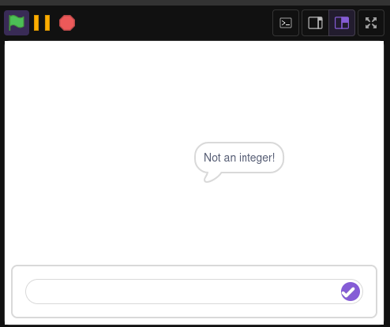

# Fibonacci sequence!

Let's make a simple [Fibonacci sequence](https://en.wikipedia.org/wiki/Fibonacci_sequence) calculator! In this lesson, we'll go step by step

### 1: Ask the user which number to calculate from
```
import sensing::ask;
import looks::say;

on GreenFlag {
    str number = ask("Fibonnaci number?");
}
```

### 2: Fix the huge issue
Notice how the `ask` function returns a string? What if the user just ignores the question and inputs "hello" instead?

To fix this, we have to enforce that the "number" we have is an `integer`
In scratcher, we do this with the `cast` standard library. Import it:
```
import cast;
```
And now after we ask the user for a number, we can cast it to an `int`
```
on GreenFlag {
    str number = ask("Fibonnaci number?");
    int realNumber = cast::toInt(number);
}
```
Or more concisely
```
on GreenFlag {
    int number = cast::toInt(ask("Fibonnaci number?"));
}
```
Now, if the user doesn't input a valid integer, the `cast` library will cause a `panic`, which immediately stops all execution and shows an error, then stops the program.


**Note**: You could also use a fallback value instead of crashing, using `toIntOrDefault`:
`cast::toIntOrDefault(number, fallback)`

### 3: Now let's make a custom function

```
int fib(int n) {
    
}
```
This defines a custom `fib` function that takes in an integer(n) and returns an integer. 
It does not compile because it does not have a return.

### 4: Now let's make a recursive function
[Recursive functions](https://en.wikipedia.org/wiki/Recursive_function) are functions that call themselves, causing the program to never end unless it runs out of memory.

Fibonacci works by calculating the sum of the last 2 numbers of the sequence, this is easy to represent as a scratcher function.
```
int fib(int n) {
    return fib(n - 1) + fib(n - 2);
}
```
This calculates `fib(n - 1)`, the last number of the sequence and then calculates `fib(n - 2)`, the second to last number of the sequence, adds them together and `return`s them.

Fib now compiles! But there's still 2 huge problems:
- We do not have a base case, so it runs forever!
  - It runs without screen refresh disabled, making it very slow.

### 5: Add a base case
Right now, when you call `fib`, it runs forever until you run out of memory. To prevent this, you need a `base case`.

A `base case` is "a terminating scenario that does not use recursion to produce an answer"[¹](https://en.wikipedia.org/wiki/Recursion)

We add the `base case` using a `return` with a condition. There are 2 ways to do this.

- Traditional:
```
int fib(int n) {
    if (n <= 1) {
        return n;
    }

    return fib(n - 1) + fib(n - 2);
}
```
- Simpler:
```
int fib(int n) {
    return n if (n <= 1);
    
    return fib(n - 1) + fib(n - 2);
}
```
They both do the exact same thing, return `n` if `n <= 1`. This creates a `base case` that returns `n` without using any recursion.

###  6: Make the `fib` function more performant
If you've ever used scratch before, you would know that the `Run without screen refresh` button is really useful as it makes `procedures` run faster, right now the `fib` function does not have this checked.

Simply enable it with the `warp` modifier:
```
warp int fib(int n) {
    ...
}
```

### 7: Call the `fib` function from the green flag

```
on GreenFlag {
    int number = cast::toInt(ask("Fibonnaci number?"));
    int out = fib(number);
    say("Fibonacci sequence's ${number}th element is ${out}!");
}
```

Nice! We have successfully made a fibonacci calculator in Scratcher!