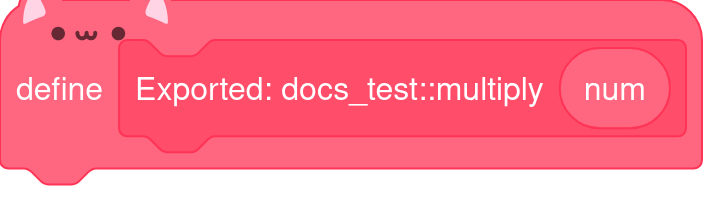
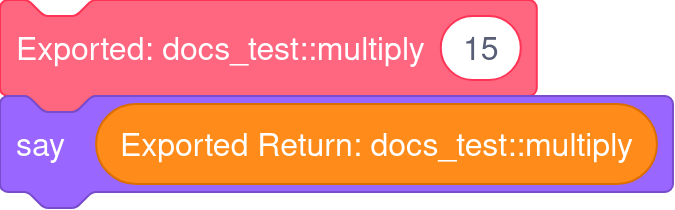

# Function modifiers
In scratcher, functions can have modifiers that let them behave differently

## 1: `warp`
The warp modifier translates directly to the scratch "Run without screen refresh" checkbox.
If a function has the `warp` modifier, it will be marked "Run without screen refresh".

## 2: `export`
The export modifier lets simple functions be called directly from scratch. If this modifier isn't present on a function, native scratch can't reliably call it without breaking the heap.

The export modifier only accepts functions that only take in primitive types and return a primitive type.

Exported functions create simple to use scratch blocks and create their own return variables.

```
export int multiply(int num) {
    return num * 3;
}
```
Translates to:



And to use it in native scratch code, you just do:



## 3: `private`
The private modifier restricts the usage of the function from outside the `current file`

## 4: `operator`
The operator modifier allows the function to be used as an operator, operators that are allowed to be overridden are:

- `+`
- `-`
- `/`
- `*`
- `%`
- `[]`
- `[] = ..`

All of these expect different function signatures:
`x + y`: `Any plus(Any, Any)`
`x - y`: `Any minus(Any, Any)`
`x / y`: `Any div(Any, Any)`
`x * y`: `Any times(Any, Any)`
`x % y`: `Any mod(Any, Any)`
`[]`: `Any Any.get(Any index)`
`[] = ...`: `void Any.set(Any index, Any item)`

## Next up
- Check out the [cheatsheet](cheatsheet.md) for the rest of the language!