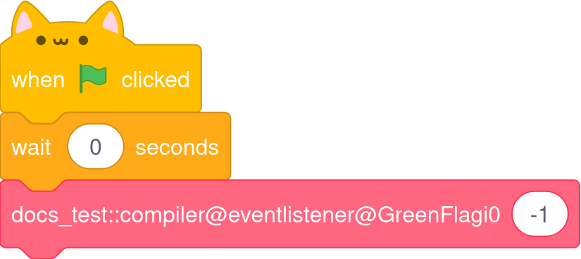
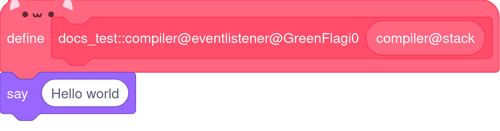

# Writing your first scratcher program

The hello world in scratcher looks like this:
```
import looks::say;

on GreenFlag {
    say("Hello world");
}
```

## What this does

- `import looks::say`: This imports the `say` function from the `looks` standard library and tells the compiler to import it.
- `on GreenFlag`: This is an `event handler` that runs when the `green flag` is clicked.
- `say("Hello world");`: This calls the `say` function we imported earlier with the string: "hello world"

When run, this project will make the scratch cat say "Hello world"

## Exercise

- Make the cat say "Hello (your name here)" now
- Next up, let's learn about [inputs](inputs.md)

### Notes

This entire project compiles directly to this scratch code:



The reason the `wait 0 seconds` block is injected before your actual code is to set up the runtime and heap. 
As the programmer writing code, you don't need to worry about this.