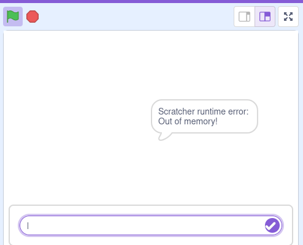

# Out of memory?


Vanilla scratch limits lists to 200k elements, this is bad for Scratcher because Scratcher uses a single scratch list for the heap.

Scratcher by default prevents this by using 2 garbage collectors to prevent memory leaks.

But even with the garbage collectors, it is still possible to run out memory, to prevent this Scratcher provides safe and easy ways to get around this limit:

## TurboWarp
- TurboWarp removes this arbitrary limitation, just switching to TurboWarp will make your project work again.

## Compact lists
Scratcher provides compact lists, a way to store a ton of data while only using a couple of elements in the heap.
- They must be integer lists.
- Based on the current garbage collection mode, compact lists can take 2-4 elements in the heap, while being able to represent up-to millions of integers, at the cost of lookup performance.
- To use them, import the `compact_list` library:
```
import compact_list::*;
```
- Create a new compact list:
```
//empty
IntList myList = newIntList();

//from regular list
List<int> myList = ...;
IntList myCompactList = myList.toCompact();

//convert back
List<int> myNewList = myCompactList.fromCompact();
```
- Usage is just like normal lists, but a couple less operations exist:
```
myList.add(5);
myList.removeAt(0);
myList.remove(5);
myList.length();
myList.isEmpty();
myList.isNotEmpty();

int obj = myList[5];
myList[4] = obj;

myList.indexOf(obj);
myList.contains(obj);

myList.firstOrNull();
myList.lastOrNull();

myList.forEach((int item) -> {});
myList.map((int item) -> { item * 2 });
```

## Out of heap storage
You can also store stuff outside the heap by using **Static lists** and **Pooled lists**

### Static lists
Static lists allow for creating vanilla scratch lists.
- They are special and any operation involving them must have its list be resolved.
- This means: you must store them in global variables, and they can never be passed as function arguments
- They can only store strings.
```
static str[] myList;

on GreenFlag {
    myList.add("5");
    str the5 = myList[1];
    myList[1] = "555555";
    
    myList.clear();
    myList.length();
    myList.contains("55");
    myList.indexOf("55");
    myList.insert(5, "hi");
}
```
Static lists are 1-indexed unlike all other lists in Scratcher.

### Pooled lists
Pooled lists are a pool of static lists managed by the compiler.
- They allow you to write normal code with static lists, they can be passed around, and they don't have a global variable requirement.

As for downsides:
- They have small overhead on any operation (minimized by binary search dispatch)
- You must manually manage their lifecycle using the allocator. They won't be garbage collected automatically.
- They can only store strings.

To use them:
```
import list_pool::*;

PooledList a = allocate(); //will panic if the pool is empty
PooledList? a = allocateOrNull(); //will return null instead of panic-ing

a.add("hi!");
str hi = a[0];
a[0] = hi;

a.clear();
a.length();
a.contains("55");
a.indexOf("55");
a.insert(5, "hi");

//remember to free when done with it.
//this will give the list back to the pool so it can be allocated again
a.free();
```